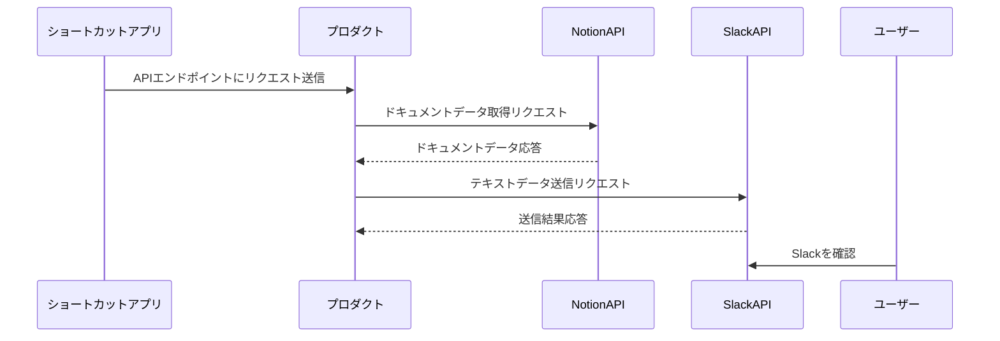

# 処理シーケンス

```mermaid
sequenceDiagram
    participant ショートカットアプリ
    participant プロダクト
    participant NotionAPI
    participant SlackAPI
    participant ユーザー

    ショートカットアプリ ->> プロダクト: APIエンドポイントにリクエスト送信
    プロダクト ->> NotionAPI: ドキュメントデータ取得リクエスト
    NotionAPI -->> プロダクト: ドキュメントデータ応答
    プロダクト ->> SlackAPI: テキストデータ送信リクエスト
    SlackAPI -->> プロダクト: 送信結果応答
    ユーザー ->> SlackAPI: Slackを確認
```
