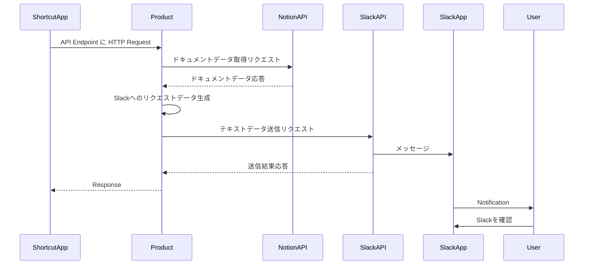

# Sequence

```mermaid
sequenceDiagram
    participant ShortcutApp
    participant Product
    participant NotionAPI
    participant SlackAPI
    participant SlackApp
    participant User

    ShortcutApp ->> Product: API Endpoint に HTTP Request

    Product ->> NotionAPI: ドキュメントデータ取得リクエスト
    NotionAPI -->> Product: ドキュメントデータ応答

    Product ->> Product: Slackへのリクエストデータ生成

    Product ->> SlackAPI: テキストデータ送信リクエスト
    SlackAPI ->> SlackApp: メッセージ
    SlackAPI -->> Product: 送信結果応答
    Product -->> ShortcutApp: Response

    SlackApp ->> User: Notification
    User ->> SlackApp: Slackを確認
```
