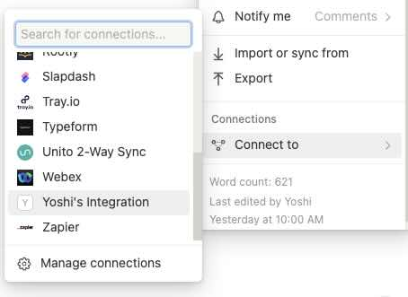

# 定期的に処理を起動させる方法

iPhone標準のショートカットアプリの「オートメーション」を使用する。
参照: [iOSショートカットを時間で起動させる【iPhoneオートメーション】 | 生焼けプログラマーの雑記帳](https://namayakegadget.com/2279/)

# Notion API

APIリファレンスはこちら
[Introduction](https://developers.notion.com/reference/intro)

## Notion API を使用する手順

1. インテグレーションを作成しておく([参照](https://developers.notion.com/docs/create-a-notion-integration#create-your-integration-in-notion))
2. インテグレーションに特定Notionページへのアクセスを許可する
    

## THANKSFULNESS LIST のデータを取得するAPI

※2024/02/20時点で最新のNotionAPIバージョンを使用。最新バージョンは[こちら](https://developers.notion.com/reference/changes-by-version)より確認すること。

[Retrieve block children](https://developers.notion.com/reference/get-block-children)
GET `/v1/blocks/{block_id}/children`

```bash
curl 'https://api.notion.com/v1/blocks/'"$NOTION_THANKSFULNESS_BLOCK_ID"'/children?page_size=100' \
  -H 'Authorization: Bearer '"$NOTION_API_KEY"'' \
  -H "Notion-Version: 2022-06-28"
```

# Slack API

使用実績のある WebhookURL を利用したメッセージ送信を検討していたが、URLが漏れれば誰でもメッセージを送信できてしまう。セキュリティの観点より、 `chat.postMessage` WebAPI を利用する。

Ref [chat.postMessage method | Slack](https://api.slack.com/methods/chat.postMessage)

<details><summary>Webhookを使用した場合のメッセージングAPIリファレンスはこちら</summary>

[Sending messages using incoming webhooks | Slack](https://api.slack.com/messaging/webhooks)

</details>

## Slack API を使用する手順

1. [こちら](https://api.slack.com/apps)にアクセス
2. Create New App
3. Permission を設定
    1. chat:write
    2. chat:write.customize
      
4. Install to Workspace
   1. OAuth の認可を求める画面が表示されるので、問題なければ許可する
5. `xoxb` で始まる Bot User OAuth Token が発行される

Ref [Slack API 推奨Tokenについて #Slack - Qiita](https://qiita.com/ykhirao/items/3b19ee6a1458cfb4ba21)

<details>
<summary>Slackメッセージに用いるJSONサンプル</summary>

```json
{
  "channel": "4-thanksfulness",
  "username": "Thanksfulness",
  "icon_emoji": ":gratitude-thank-you:",
  "attachments": [
    {
      "fallback": "Thanksfulness List",
      "color": "#ffb6c1",
      "blocks": [
        {
          "type": "header",
          "text": {
            "type": "plain_text",
            "text": ":heart_hands:感謝！:heart_hands:"
          }
        },
        {
          "type": "context",
          "elements": [
            {
              "type": "mrkdwn",
              "text": "5分間じっくり噛み締めよう:eyes:"
            }
          ]
        },
        {
          "type": "divider"
        },
        {
          "type": "rich_text",
          "elements": [
            {
              "type": "rich_text_list",
              "style": "bullet",
              "elements": [
                {
                  "type": "rich_text_section",
                  "elements": [
                    {
                      "type": "text",
                      "text": "item 1"
                    }
                  ]
                },
                {
                  "type": "rich_text_section",
                  "elements": [
                    {
                      "type": "text",
                      "text": "item 2"
                    }
                  ]
                },
                {
                  "type": "rich_text_section",
                  "elements": [
                    {
                      "type": "text",
                      "text": "item 3"
                    }
                  ]
                },
                {
                  "type": "rich_text_section",
                  "elements": [
                    {
                      "type": "text",
                      "text": "item 4"
                    }
                  ]
                },
                {
                  "type": "rich_text_section",
                  "elements": [
                    {
                      "type": "text",
                      "text": "item 5"
                    }
                  ]
                }
              ]
            }
          ]
        },
        {
          "type": "context",
          "elements": [
            {
              "type": "mrkdwn",
              "text": "Edited on 2024/02/16"
            }
          ]
        }
      ]
    }
  ]
}
```

</details>

# 技術スタック

## 言語

Golang

TypeScript以外もそろそろ使ってみたいから。

## Webフレームワーク

[Gin](https://gin-gonic.com/ja/)

Express.jsに似てて使いやすそうだし、RESTにもGraphQLにも対応できそうで汎用性が高いことが期待できるから。

## クラウド

GCP

楽そうで料金安そうだから。
